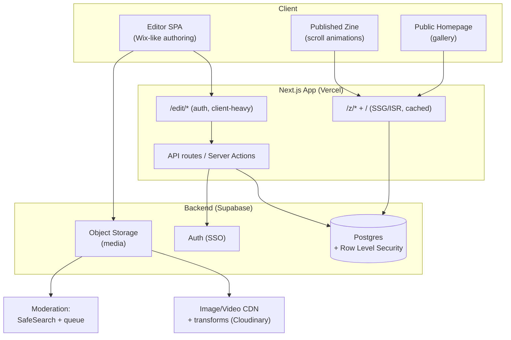
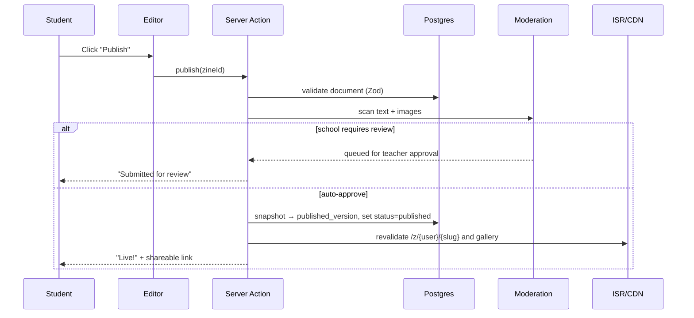

# Zine — Architecture Plan

A digital "scrollytelling" zine-making tool for high-school writing students, modeled on
[The Pudding](https://pudding.cool/). Students author rich, scroll-animated visual essays with
simple Wix-like tools; finished zines are published to a public gallery.

> **Stack update (decided):** the frontend is **SvelteKit**, not Next.js/React. The stack sections
> below (§3, §5, §16) and the editor/state notes reflect that. The build sequence lives in
> [IMPLEMENTATION_PLAN.md](IMPLEMENTATION_PLAN.md); the evaluation rubric in [REQUIREMENTS.md](REQUIREMENTS.md).

> **Implementation guidance (for AI):** normative, Pudding-derived best practices for scrollytelling,
> responsive/performance, charts, and the editorial process live in
> [docs/best-practices/](docs/best-practices/README.md). Read the relevant one before building a feature
> it covers — they turn §5's animation system and the editor into specific, citable rules.

---

## 1. Goals & Constraints

| #   | Requirement                                                                               | Architectural implication                                                      |
| --- | ----------------------------------------------------------------------------------------- | ------------------------------------------------------------------------------ |
| 1   | Students have accounts and manage their own zines                                         | Auth + per-user ownership + roles (student / teacher / admin)                  |
| 2   | Zines publicly displayed on a homepage                                                    | Public gallery + fast, cacheable published pages                               |
| 3   | Pudding-style structure (headings, images, links, sections)                               | Block-based **document model** (structured JSON), not free-form HTML           |
| 4   | "Fancy" scroll animations (parallax, horizontal-on-scroll, scroll-zoom dataviz, flocking) | A **declarative animation system** mapping presets → animation libraries       |
| —   | Users are **minors in a school setting**                                                  | FERPA/COPPA, SSO, moderation, accessibility are first-class, not afterthoughts |

### Guiding principles

1. **Separate the document from its rendering.** Authoring produces structured JSON; a renderer
   interprets it. This is the single most important decision — it lets the editor, the published
   page, animations, and themes all evolve independently.
2. **Animations are data, not code.** Students never write code. They pick presets and tune a few
   knobs. Each preset is backed by a battle-tested library under the hood.
3. **Author static, preview in motion.** Editing a parallaxing/pinned element in place is painful.
   The editor edits a calm, static layout; a Preview toggle plays the real animations.
4. **Published pages are (mostly) static.** Render-on-publish + CDN means the public site scales to
   any traffic for near-zero cost and is fast on school Chromebooks.
5. **Safety and accessibility are requirements, not features.** Minors + public content + schools =
   moderation, `prefers-reduced-motion`, alt-text enforcement, and WCAG AA are non-negotiable.

---

## 2. System Overview



**Two faces, one app:**

- **Authoring side** (`/edit/*`) — a rich client-side **Svelte** app. Stateful, interactive, behind auth.
- **Reading side** (`/`, `/z/*`) — statically rendered, CDN-cached, public, SEO-friendly, fast.

A single **SvelteKit** codebase serves both, sharing the **block component library** and **document
schema** so that "what you author" matches "what gets published."

---

## 3. Technology Stack

| Layer                         | Choice                                                         | Why                                                                                                                                                                                                                                                                                                                                   |
| ----------------------------- | -------------------------------------------------------------- | ------------------------------------------------------------------------------------------------------------------------------------------------------------------------------------------------------------------------------------------------------------------------------------------------------------------------------------- |
| **Framework**                 | **SvelteKit + TypeScript**                                     | One framework does the dynamic editor _and_ the static published pages (SSG/ISR/prerender). Shared block components avoid editor/reader drift; compiles to lean JS for weak hardware.                                                                                                                                                 |
| **Hosting**                   | **Vercel** (`adapter-vercel`, or Netlify / Cloudflare)         | ISR + global CDN + preview deploys for SvelteKit.                                                                                                                                                                                                                                                                                     |
| **Backend / BaaS**            | **Supabase** (Postgres + Auth + Storage)                       | Postgres for the relational data + JSON documents; built-in Auth with SSO; Storage for media; **Row-Level Security** enforces "students edit only their own zines" at the database. Minimal backend code to own. _(Alt: Firebase — attractive because schools live in Google Workspace; weaker relational querying for the gallery.)_ |
| **Editor engine**             | **Custom canvas on `svelte-dnd-action` + Svelte stores**       | Gives the Wix-like drag/drop, layers panel, and inspector. No Puck/Craft equivalent in Svelte, so the canvas is built in-house — which buys full control of the animation inspector.                                                                                                                                                  |
| **Rich text**                 | **TipTap** (`svelte-tiptap`, ProseMirror)                      | For text blocks: headings, bold/italic, links, lists — outputs structured JSON, not raw HTML.                                                                                                                                                                                                                                         |
| **Scroll animation core**     | **GSAP + ScrollTrigger**                                       | The industry standard for scrollytelling: scrubbing, pinning, horizontal scroll, timelines. Powers most Pudding-style work.                                                                                                                                                                                                           |
| **Scroll step triggers**      | **Scrollama**                                                  | IntersectionObserver-based "steps" — exactly the pattern The Pudding open-sourced for sticky-graphic scrollytelling.                                                                                                                                                                                                                  |
| **Declarative motion**        | **Svelte built-ins** (`svelte/motion`, `svelte/transition`)    | Tweened/spring stores for simple parallax + enter animations — no extra dependency.                                                                                                                                                                                                                                                   |
| **Smooth scroll**             | **Lenis**                                                      | Smooths native scroll; pairs with GSAP for buttery parallax/pin. (Respect `prefers-reduced-motion`.)                                                                                                                                                                                                                                  |
| **Data visualization**        | **D3.js** (+ optional **visx**)                                | Scroll-scrubbed/zooming charts.                                                                                                                                                                                                                                                                                                       |
| **Flocking / particles / 3D** | **Threlte** (`@threlte/core`, Three.js), or **Pixi.js** for 2D | Boids/flocking (Reynolds algorithm), particle fields, zoom effects. WebGL = thousands of agents at 60fps.                                                                                                                                                                                                                             |
| **Vector animations**         | **Lottie** (lottie-web)                                        | Designer-made looping animations as lightweight JSON (better than GIF).                                                                                                                                                                                                                                                               |
| **State (editor)**            | **Svelte stores** + **Immer**                                  | Document tree state, undo/redo via patches.                                                                                                                                                                                                                                                                                           |
| **Media optimization**        | **Cloudinary** (or imgix / `@sveltejs/enhanced-img`)           | On-the-fly resize/format (WebP/AVIF), plus moderation hooks.                                                                                                                                                                                                                                                                          |
| **Validation**                | **Zod**                                                        | One schema validates documents at save, publish, and render.                                                                                                                                                                                                                                                                          |

> The brief said "use libraries" for animation — the stack deliberately leans on GSAP/ScrollTrigger,
> Scrollama, D3, and Threlte (Three.js) rather than hand-rolling motion. These are framework-agnostic;
> only R3F→Threlte and Framer Motion→Svelte built-ins changed when moving off React.

---

## 4. The Content Model (heart of the system)

A zine is a **document**: an ordered list of **Sections**, each containing ordered **Blocks**.
Sections own layout/background; blocks own content. Both can carry an **animation** descriptor.

```jsonc
{
	"schemaVersion": 1,
	"theme": { "palette": "ink", "fontPair": "editorial", "accent": "#E4572E" },
	"sections": [
		{
			"id": "sec_a1",
			"layout": "full-bleed", // centered | split | grid | full-bleed
			"background": { "type": "canvas", "effect": "flocking", "params": { "count": 300 } },
			"animation": { "type": "pin-horizontal" }, // section-level (e.g., side-scroll)
			"blocks": [
				{
					"id": "blk_01",
					"type": "heading",
					"props": { "text": "Why We Read at Night", "level": 1 },
					"style": { "align": "center", "size": "display" },
					"animation": { "type": "fade-up", "trigger": "enter", "duration": 0.6 }
				},
				{
					"id": "blk_02",
					"type": "image",
					"props": { "assetId": "ast_77", "alt": "A lamp-lit desk", "caption": "..." },
					"animation": { "type": "parallax", "axis": "y", "speed": 0.4 }
				}
			]
		}
	]
}
```

### Block types (extensible registry)

| Category    | Blocks                                                                                                     |
| ----------- | ---------------------------------------------------------------------------------------------------------- |
| Text        | `heading`, `richText`, `pullQuote`, `list`                                                                 |
| Media       | `image`, `gallery`, `video`, `lottie`, `embed` (YouTube/Vimeo)                                             |
| Structure   | `link` / `button`, `divider`, `spacer`, `columns`                                                          |
| Interactive | `dataViz` (chart), `flockingCanvas`, `scrollSequence` (image sequence), `stickyStep` (scrollytelling step) |

Each block type is one entry in a **Block Registry**:

```ts
registerBlock('image', {
	schema: ImagePropsZod, // validation
	Editor: ImageEditor, // inspector controls
	Render: ImageBlock, // the published component
	defaults: { alt: '' },
	allowedAnimations: ['parallax', 'fade-up', 'zoom-in', 'none']
});
```

Adding a new block = adding one registry entry. The editor inspector, validator, and renderer all
read from the registry, so they never drift apart.

---

## 5. The Animation System

This is the differentiator and the hardest part. Design goal: **a fixed palette of presets, each
parameterized by a few knobs, each backed by a library** — composable by students who can't code.

### 5.1 Declarative descriptor

Every animation in the document is just data:

```jsonc
{ "type": "parallax",        "axis": "y", "speed": 0.4 }
{ "type": "fade-up",         "trigger": "enter", "duration": 0.6, "distance": 40 }
{ "type": "pin-horizontal",  "contentWidth": "200vw" }
{ "type": "scroll-zoom",     "from": "left", "scale": [0.6, 1] }
{ "type": "sticky-steps",    "steps": ["blk_03","blk_04","blk_05"] }
{ "type": "flocking",        "count": 300, "color": "#222", "reactTo": "scroll" }
```

### 5.2 Animation Registry → library binding

A registry maps each `type` to an implementation. The renderer wraps blocks/sections with a
`use:animate` action (or `<Animated>` wrapper) that looks up the impl and wires the library to the node.

| Preset                 | Student-facing name | Backed by                                     | Notes                                                                    |
| ---------------------- | ------------------- | --------------------------------------------- | ------------------------------------------------------------------------ |
| `parallax`             | "Parallax"          | Svelte `svelte/motion` (simple) or GSAP scrub | Element drifts at a different speed than scroll.                         |
| `fade-up` / `slide-in` | "Appear on scroll"  | Scrollama / IntersectionObserver              | Enters when it scrolls into view. Direction + distance knobs.            |
| `pin-horizontal`       | "Side-scroll"       | **GSAP ScrollTrigger** (pin + x-translate)    | Section pins; content slides sideways as you scroll down.                |
| `scroll-zoom`          | "Zoom from side"    | GSAP ScrollTrigger (scrub scale/translate)    | Dataviz/image zooms in from an edge, tied to scroll progress.            |
| `sticky-steps`         | "Sticky story"      | **Scrollama**                                 | Classic Pudding pattern: one sticky graphic, text steps drive its state. |
| `flocking`             | "Flocking"          | **Threlte / Three.js** (or Pixi) boids        | Background swarm; optional scroll/mouse reactivity.                      |
| `dataViz-scrub`        | "Animated chart"    | **D3** + ScrollTrigger                        | Chart draws/transitions across scroll.                                   |

```ts
animationRegistry['pin-horizontal'] = {
	paramsSchema: PinHorizontalZod,
	// lazy import so simple zines never ship GSAP
	load: () => import('./impls/pinHorizontal')
};
```

### 5.3 Performance & accessibility rules (enforced by the framework, not the student)

- **Lazy-load heavy libs per animation type** (dynamic `import()`): a text-only zine never downloads
  Three.js or GSAP.
- **Mount heavy effects only when near viewport** (IntersectionObserver); unmount canvases when off-screen.
- **`prefers-reduced-motion`**: globally degrade — parallax/scrub → static, flocking → still frame,
  pins → normal flow. One switch, honored everywhere.
- **Transform/opacity only** for scroll animation (GPU-friendly); avoid layout-thrashing properties.
- **Mobile fallbacks**: pinned horizontal scroll and dense particle fields get lighter variants on small/low-power devices.
- **FPS budget**: particle counts and effect density are capped by preset to protect Chromebooks.

This is why presets matter: students get the _look_ of Pudding without the ability to build a
janky, inaccessible page.

---

## 6. Editor Architecture (the "Wix-like" tool)

```
┌──────────────────────────────────────────────────────────────┐
│  Toolbar:  [Edit | Preview]   Undo Redo   Device▾   Publish   │
├──────────┬───────────────────────────────────┬───────────────┤
│ Blocks   │            Canvas                  │  Inspector    │
│ palette  │   (sections + blocks, drag/drop)   │  - Content    │
│ (drag in)│   Edit mode = static & calm        │  - Style      │
│          │   Preview mode = real animations   │  - Animation▾ │
├──────────┴───────────────────────────────────┴───────────────┤
│  Layers / outline (reorder sections & blocks)                 │
└──────────────────────────────────────────────────────────────┘
```

- **Drag & drop** add/reorder via **dnd-kit**; **Layers** panel mirrors the document tree.
- **Inspector** is registry-driven: selecting a block shows its content controls + an **Animation**
  dropdown limited to that block's `allowedAnimations`, each with simple sliders/toggles.
- **Edit vs Preview toggle** — Principle #3. Edit mode renders blocks in document order, static,
  with little animation badges; Preview mode plays the real thing.
- **Document state** in Zustand; mutations as Immer patches → free **undo/redo** and a clean
  autosave diff.
- **Autosave**: debounced (~2s) writes of the document JSON; optimistic UI; "Saved ✓" indicator.
- **Version history**: keep periodic snapshots so students can recover work (and teachers can see
  progress). Student work loss is unacceptable.
- **Responsive preview**: desktop / tablet / mobile widths.
- **Templates**: starter zines ("photo essay", "data story", "interview") so a blank page isn't
  intimidating.

---

## 7. Publishing & Rendering Pipeline



- **Draft vs published are separate snapshots.** Editing a live zine doesn't change the public page
  until re-published. Safe and predictable.
- **Public URL**: `/z/{username}/{slug}` (stable, shareable, SEO/OpenGraph cards for sharing).
- **Rendering**: **ISR** — published pages are statically generated on publish and served from CDN;
  revalidated only when re-published. Scales to viral traffic at ~zero cost; fast on weak networks.
- **Homepage `/`**: gallery of published zines (cover + title + author), with featured/teacher-picked
  rows, search, and filters. Also ISR, revalidated when zines publish.

---

## 8. Data Model

```sql
-- Identity & cohorts
users(id, role ENUM['student','teacher','admin'], display_name, school_id, created_at)
schools(id, name)                         -- optional multi-tenant
classes(id, teacher_id, school_id, name, join_code)
class_members(class_id, student_id)

-- Content
zines(id, owner_id, title, slug, status ENUM['draft','in_review','published','unlisted'],
      cover_asset_id, theme JSONB, created_at, updated_at)
zine_drafts(zine_id PK, document JSONB, updated_at)          -- live editable doc
zine_versions(id, zine_id, document JSONB, label, created_at) -- history + published snapshots
zine_publications(zine_id PK, version_id, published_url, published_at)

-- Media
assets(id, owner_id, kind ENUM['image','video','lottie'], storage_path,
       width, height, alt, moderation_status, created_at)

-- Safety
moderation_items(id, target_type, target_id, status, reason, reviewed_by, created_at)
reports(id, zine_id, reporter_id, reason, status, created_at)
```

- **`document JSONB`** holds the block tree (Section 4). Postgres JSONB = flexible content + still
  queryable.
- **Row-Level Security**: `zines`/`zine_drafts` writable only by `owner_id` (and the owner's
  teacher); published reads are public. Authorization lives in the database, not just app code.
- **Versions** give autosave history, recovery, and immutable published snapshots.

---

## 9. Accounts, Auth & Roles

- **Roles**: `student`, `teacher`, `admin`.
  - _Student_: create/edit own zines, submit to publish.
  - _Teacher_: manage class roster (join code), review/approve publishing, moderate, feature work.
  - _Admin_: school-wide settings, user management.
- **Auth strategy (school-aware)** — prefer SSO over collecting kids' passwords:
  - **Google Sign-In / Google Classroom** (most schools run Google Workspace for Education), and/or
  - **Clever / ClassLink** (district rostering standards), with
  - **Teacher-provisioned accounts via class join codes** as the baseline (avoids open self-signup by minors).
- **Why**: minimizing self-collected PII from minors sidesteps a lot of COPPA/FERPA burden and
  matches how schools actually onboard tools.

---

## 10. Media Pipeline

1. Student uploads → Supabase Storage (or direct-to-Cloudinary signed upload).
2. **Moderation on ingest**: image SafeSearch (Google Vision / AWS Rekognition / Hive); flagged
   assets quarantined pending teacher review.
3. **Optimization/delivery** via Cloudinary/Next Image: responsive sizes, WebP/AVIF, lazy loading.
4. **Animation formats**: prefer **Lottie** (vector JSON) and **MP4/WebM** over heavy GIFs; APNG/WebP
   for short loops.
5. **Alt text is required** in the image inspector before publish (enforced by validation) — both an
   accessibility and a pedagogy win for a _writing_ class.

---

## 11. Safety, Moderation & Compliance (school context)

> Minors + public content + schools → this section is a requirement, not a nicety.

- **Publishing gate**: configurable per class — default **teacher approval** before a zine goes
  public (moderation queue), with optional auto-approve.
- **Visibility tiers**: `draft` → `in_review` → `published` (public) or `unlisted` (link-only, e.g.
  share within school) — so not everything must be world-public.
- **Text + image moderation**: profanity/PII screening on text; SafeSearch on images; **report**
  button on public pages routes to teachers/admins.
- **Compliance**: FERPA + COPPA posture — SSO/district rostering, minimal PII, signed data-processing
  terms, data export/delete, no third-party ad tracking/analytics that profile minors.
- **Auditability**: who published/approved what, and version history.

---

## 12. Accessibility (WCAG 2.1 AA — legally expected for schools)

- **`prefers-reduced-motion`** globally degrades every animation preset (Section 5.3).
- **Required alt text**; semantic heading levels enforced by the heading block.
- **Keyboard navigable** editor and reader; visible focus; color-contrast checks in the theme picker.
- **No information conveyed by motion alone**; animations are enhancement, content works without them.

---

## 13. Non-Functional Concerns

| Concern                         | Approach                                                                                                                                           |
| ------------------------------- | -------------------------------------------------------------------------------------------------------------------------------------------------- |
| **Performance**                 | Static/ISR public pages + CDN; per-animation code-splitting; image optimization; FPS-capped effects. Target good Core Web Vitals on Chromebooks.   |
| **Scalability**                 | Reading scales via CDN (static). Only the editor + API are dynamic; Supabase handles that load.                                                    |
| **Cost**                        | BaaS + static hosting keeps fixed cost low; media bandwidth is the main variable (mitigated by CDN + AVIF/WebP).                                   |
| **Reliability of student work** | Autosave + version snapshots + DB backups. Never lose a student's zine.                                                                            |
| **Observability**               | Error tracking (Sentry), structured logs, uptime + Web Vitals monitoring.                                                                          |
| **Testing**                     | Zod schema tests for the document model; component tests for blocks; Playwright E2E for author→publish→view; visual/perf checks on key animations. |

---

## 14. Phased Roadmap

**Phase 0 — Walking skeleton (MVP)**
Auth/SSO + roles · zine CRUD · block editor for `heading`/`richText`/`image`/`link` · autosave ·
publish → public page · homepage gallery. Animations limited to `fade-up` + simple `parallax`.

**Phase 1 — Core scrollytelling**
Animation system + inspector · presets: parallax, appear-on-scroll, **sticky-steps** (Scrollama) ·
Edit/Preview toggle · templates · `prefers-reduced-motion`.

**Phase 2 — "Fancy" effects**
**Pin-horizontal** side-scroll (GSAP) · **scroll-zoom** dataviz (D3) · **flocking**/particles (R3F)
· Lottie · galleries/embeds · responsive previews.

**Phase 3 — Classroom & safety at scale**
Teacher dashboards · class rosters/join codes · moderation queue + reporting · featured collections
· version history UI · analytics for students (views) · accessibility audit pass.

---

## 15. Key Risks & Open Decisions

| Risk / Decision                             | Recommendation                                                                                                    |
| ------------------------------------------- | ----------------------------------------------------------------------------------------------------------------- |
| **Editing animated content is confusing**   | Author-static / preview-in-motion (Principle #3). Validate early with students.                                   |
| **Scroll effects jank on Chromebooks**      | Transform-only, lazy mount, FPS caps, mobile fallbacks, perf budget per preset.                                   |
| **Scope creep on animations**               | Ship a _fixed, curated palette_ of presets, not an open animation builder.                                        |
| **Build vs buy the editor**                 | No Svelte page-builder exists — build the canvas on **`svelte-dnd-action`** (the main switching cost from React). |
| **Backend: Supabase vs Firebase vs custom** | **Supabase** for relational gallery queries + RLS; revisit if the school is all-Google → Firebase.                |
| **Auth: SSO vs email/password**             | **SSO (Google/Clever) + teacher join codes**; avoid self-signup by minors.                                        |
| **Public-by-default vs review-first**       | Default **teacher-approval** publishing; configurable per class.                                                  |

---

## 16. Recommended Libraries — Summary

- **App/render**: SvelteKit, TypeScript, Zod
- **Editor**: svelte-dnd-action, Svelte stores, Immer, TipTap (svelte-tiptap)
- **UI**: shadcn-svelte (Bits UI + Melt UI + Tailwind)
- **Animation**: GSAP + ScrollTrigger, Scrollama, Lenis, svelte/motion
- **Dataviz**: D3 (+ optional visx)
- **Flocking/3D/particles**: Threlte (Three.js) (or Pixi.js)
- **Vector animation**: Lottie (lottie-web)
- **Backend**: Supabase (Postgres + Auth + Storage, RLS)
- **Media**: Cloudinary (or @sveltejs/enhanced-img), Google Vision / AWS Rekognition (moderation)
- **Testing**: Vitest, @testing-library/svelte, Playwright, axe-core, Storybook
- **Ops**: Vercel, Sentry, GitHub Actions
